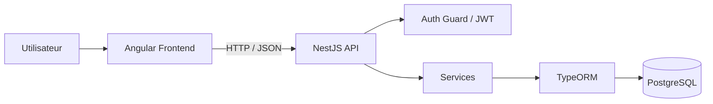

# Music Playlist — Full-Stack Web Application

Application web de gestion de playlists musicales réalisée dans le cadre d’un projet de développement web.

Le projet repose sur une architecture **frontend / backend** avec **Angular**, **NestJS** et **PostgreSQL**. Il permet à un utilisateur de créer un compte, se connecter, obtenir des tokens JWT et gérer des playlists via une API protégée.

## Ce que ce projet démontre

- développement full-stack avec Angular et NestJS ;
- création et consommation d’une API REST ;
- authentification avec access token et refresh token JWT ;
- hashage des mots de passe et refresh tokens avec bcrypt ;
- persistance des données avec PostgreSQL et TypeORM ;
- validation des données avec DTO et `class-validator` ;
- protection des routes avec guards et interceptors ;
- gestion des secrets via variables d’environnement ;
- utilisation de Git / GitHub avec un historique de commits progressif.

## Fonctionnalités principales

### Authentification
- inscription et connexion ;
- mots de passe hashés avec `bcrypt` ;
- access token et refresh token JWT ;
- refresh token stocké sous forme hashée en base ;
- route `/auth/me` ;
- protection des routes Angular avec un guard ;
- ajout automatique du token via un interceptor HTTP ;
- secrets JWT fournis uniquement par variables d’environnement.

### Gestion des playlists
- afficher la liste des playlists ;
- consulter le détail d’une playlist ;
- créer une playlist ;
- modifier une playlist ;
- supprimer une playlist ;
- routes API protégées par authentification JWT.

## Stack technique

### Frontend
- Angular
- TypeScript
- Reactive Forms
- Angular Router
- HTTP Client
- RxJS
- LocalStorage

### Backend
- NestJS
- TypeScript
- TypeORM
- PostgreSQL
- JWT
- bcrypt
- class-validator
- dotenv

## Architecture



Structure principale :

```text
playlist-project/
├── playlist-front/   # application Angular
└── playlist-api/     # API NestJS
```

Le backend est organisé en modules fonctionnels :

```text
src/
├── auth/
├── users/
└── playlists/
```

La partie `playlists` suit le flux :

```text
Controller -> Service -> Repository TypeORM -> PostgreSQL
```

## Configuration

### Backend

```bash
cd playlist-api
```

Créer un fichier `.env` à partir de `.env.example` puis renseigner :

```text
APP_PORT=3000

DB_HOST=localhost
DB_PORT=5432
DB_USERNAME=postgres
DB_PASSWORD=your_password
DB_DATABASE=playlist_db

JWT_SECRET=your_access_token_secret
JWT_REFRESH_SECRET=your_refresh_token_secret
JWT_EXPIRES_IN=15m
JWT_REFRESH_EXPIRES_IN=7d
```

Installer les dépendances et démarrer l’API :

```bash
npm install
npm run start:dev
```

### Frontend

```bash
cd playlist-front
npm install
npm start
```

## API

```text
POST   /auth/signup
POST   /auth/signin
POST   /auth/refresh
GET    /auth/me

GET    /playlist/list
GET    /playlist/:id
POST   /playlist
PUT    /playlist/:id
DELETE /playlist/:id
```

## Limites connues et améliorations possibles

- associer chaque playlist à son propriétaire afin d’isoler les données par utilisateur ;
- remplacer `synchronize: true` par des migrations TypeORM pour un environnement de production ;
- augmenter la couverture de tests ;
- améliorer la gestion globale des erreurs ;
- ajouter pagination, recherche et filtres ;
- améliorer encore l’interface et l’expérience utilisateur.

## Contexte

Projet réalisé par **Harlem Kponve Alofa**, étudiant en **Bachelier en Informatique — orientation Développement d’applications**.

Ce dépôt met principalement en évidence des compétences en **développement full-stack, TypeScript, Angular, NestJS, PostgreSQL, API REST et authentification**.
